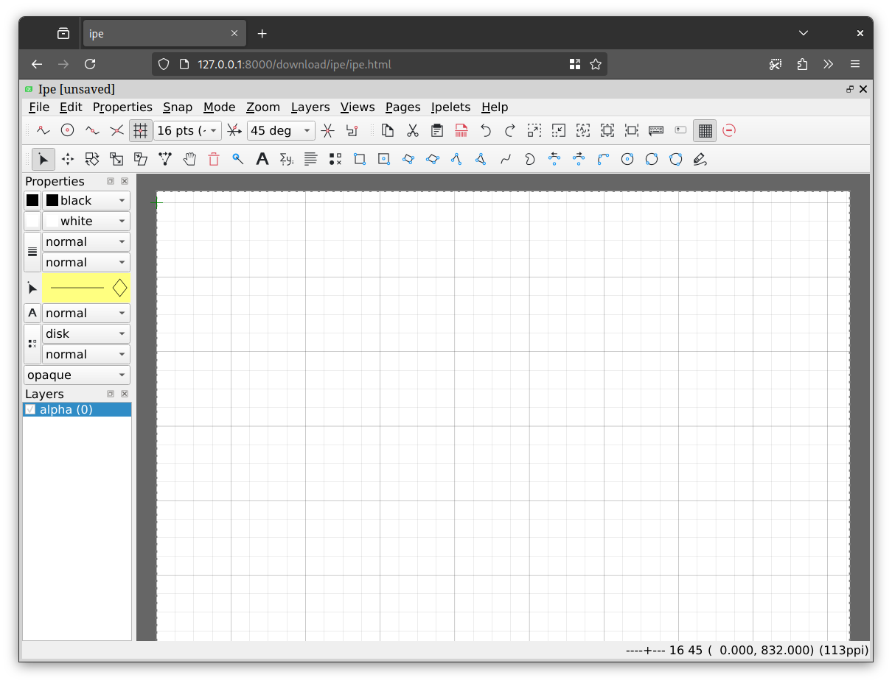

# ipe-web

This repository contains a script to build an HTML5 webassembly version of the ipe editor via emscripten.
You can try the resulting web app at [ipe.n-coder.de](https://ipe.n-coder.de/ipe.html).
The build script is targeted at a current Debian (while the resulting webassembly is of course system independent); it is recommended to run it inside a Debian docker container or VM.
Note that running this script will take quite some time (about 2h on my laptop) and will generate roughly 30GB of data, mostly due to the two required Qt 6 builds.
You can abort the script at any point and restart while re-using most of the previous results.

You will find the results in the `download/ipe` folder and can also download a precompiled version from the [releases section](https://github.com/N-Coder/ipe-web/releases) of this repo.
See the notes on running Qt6 WebAssembly code [here](https://doc.qt.io/qt-6/wasm.html#running-applications) and the blue box at the top of [this site](https://emscripten.org/docs/porting/pthreads.html), so you need a (local) webserver that sets the right HTTP headers (e.g. `qtwasmserver.py`) and cannot directly open the `.html` file locally.
While most of the UI already works, some parts (adding text, using ipelets, some dialogues,...) are broken or lead to segfaults.
Fixing Latex compilation via latexonline is currently in the works.
